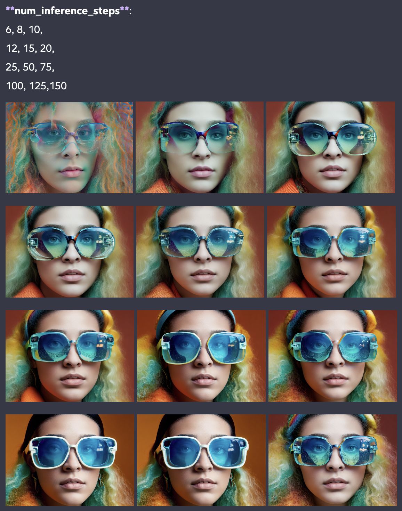
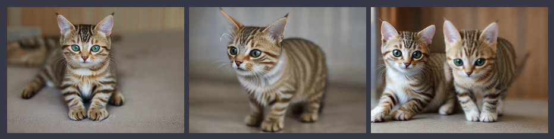
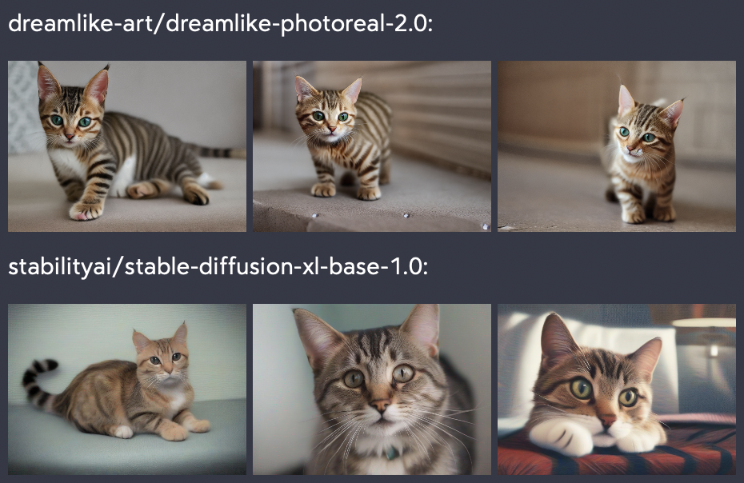
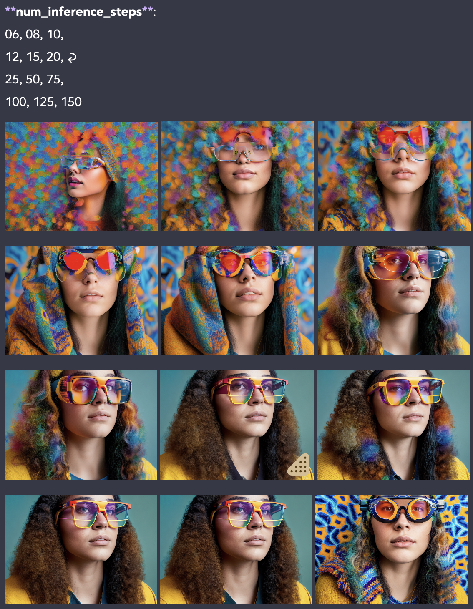
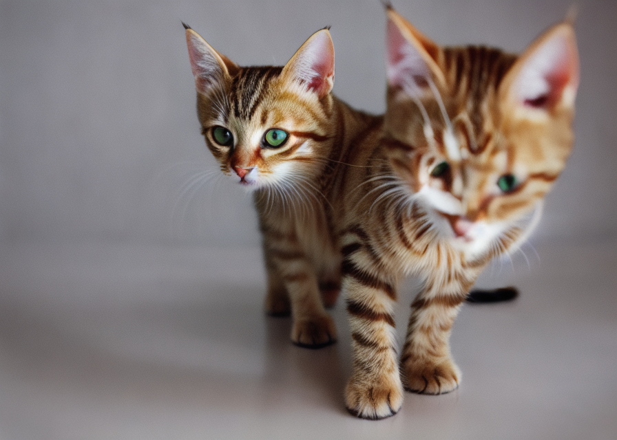
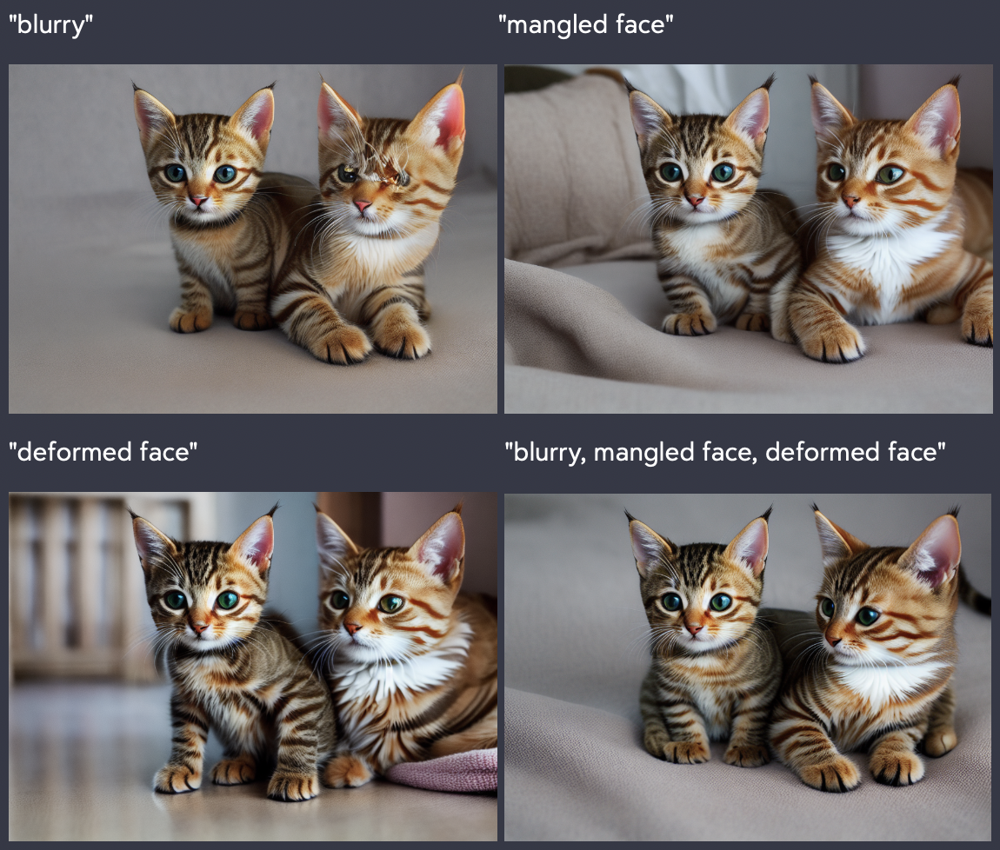
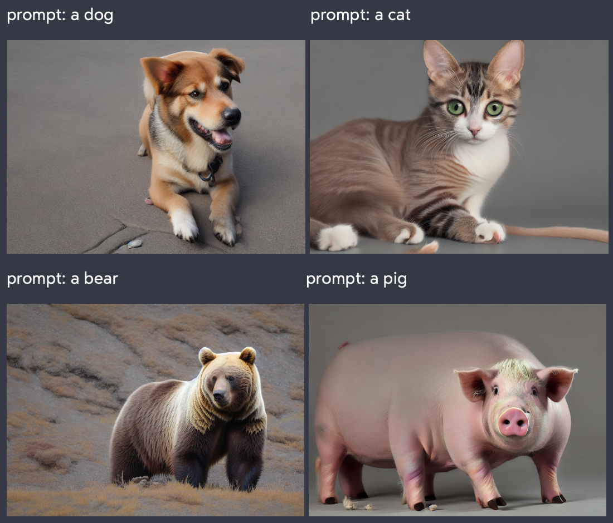
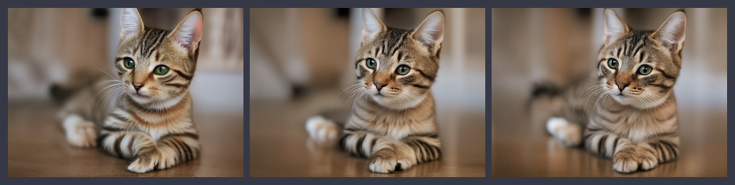
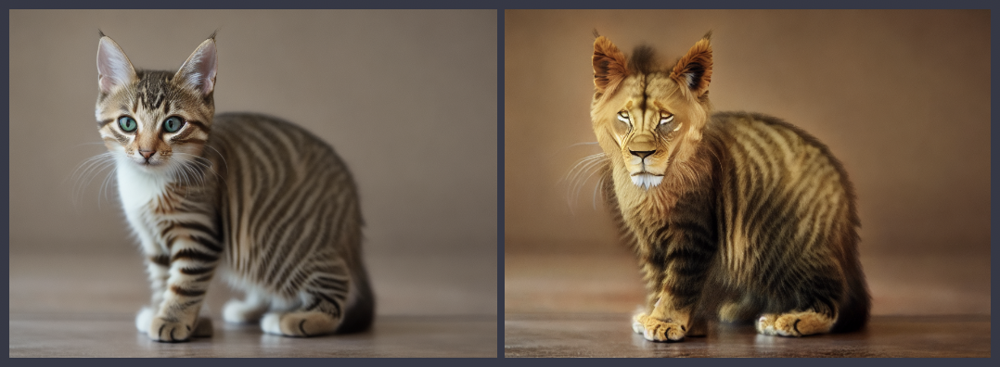

# Diffusion Bench

This is a bench for learning about prompt engineering when using text-to-image and image-to-image diffusing models. It is currently in DRAFT form... I'm not tracking breaking changes.



## Installation

If you don't have [asdf](https://github.com/asdf-vm/asdf#asdf--) (language version manager) and [direnv]() installed, start with that:

```shell
# Install python using asdf or your
# chosen version manager
brew install asdf direnv
asdf plugin add python https://github.com/danhper/asdf-python.git
asdf install python 3.10.13

# configure the version of python to use
asdf local python 3.10.13
# or asdf global python 3.10.13
# Note: when using local a ".tool-versions" file is created
```

Then you can create an install the virtual environment with direnv:

```shell
# configure your ENVVARS
# (open the .envrc file and make necessary changes)
cp .envrc-example .envrc

# create the venv, install packages, and enable ENVVARS
direnv allow .
# If you don't want to use direnv, read the .envrc-example
# file and execute most of those commands using your
# preferred method
```

#### Installation Notes

Make sure to keep the requirements.txt up to date when adding dependencies:

```shell
python3 -m pip install scipy
python3 -m pip freeze > requirements.txt
```

The original install to produce that requirements.txt was:

```shell
python3 -m pip install transformers sentencepiece diffusers \
                       ipykernel invisible_watermark accelerate \
                       safetensors torch ipyplot scipy

# For TencentARC/t2i-adapter-lineart-sdxl-1.0,
# the version of diffusers that needs to be installed is
# different than what's listed above. For that we need:

python3 -m pip install -U git+https://github.com/huggingface/diffusers.git
# and controlnet_aux for conditioning models and detectors
python3 -m pip install -U controlnet_aux==0.0.7
```

## Usage

```shell
python3 -m src [-h] [-p PROMPT] [-n NEGATIVE_PROMPT]
  [-x WIDTH] [-y HEIGHT] [-c COUNT] [-s SEEDS] [-m MODELS]
  [-r STEPS] [-o OUTPUT_PATH] [-t OUTPUT_PATH_TEMPLATE]
  [-i INPUT_PATHS] [-a REFINEMENT_MODE] [-d DEVICE_TYPE]
```

options:

- `-h`, `--help`: show this help message and exit
- `-p`, `--prompt`: A pipe-delimited list of descriptions of what you would like to render
- `-n`, `--negative_prompt`: A pipe-delimited list of descriptions of what you would NOT like to render (default=None)
- `-x`, `--width`: The width of the output image (default=896)
- `-y`, `--height`: The height of the output image (default=640)
- `-c`, `--count`: The number of images to produce with each given model (default=1)
- `-s`, `--seeds`: A comma-separated list of PRNGs to use when generating an image to produce more predictable results and explore an idea
- `-m`, `--models`: A comma-separated list of HuggingFace Models to to use. (default= dreamlike-art/dreamlike-photoreal-2.0 is used to generate an image followed by 3, sequential steps of refinement using stabilityai/stable-diffusion-xl-refiner-1.0)
- `-r`, `--steps`: A comma-separated list of the number inference steps to use with each model (length must match the length of -m)
- `-o`, `--output_path`: A path to a folder where images will be saved (can be relative)
- `-t`, `--output_path_template`: A template for naming the files (default=":path/:count_idx-:type-:model_idx.png")
- `-i`, `--input_paths`: A comma-separated list of paths to images that will be refined or upscaled by the given models
- `-a`, `--refinement_mode`: one of:
  - "sequence" (each pass is fed into the next pass),
  - "first_to_many" (each pass is fed the first item generated),
  - "in_to_many" (each pass is fed the value of -i/--input_paths)
- `-d`, `--device_type` The type of device the pipes will be fed to for processing (default="cuda" if cuda is supported, else "mps" if apple M1/M2, else "cpu")

models:

- [dreamlike-art/dreamlike-photoreal-2.0](https://huggingface.co/dreamlike-art/dreamlike-photoreal-2.0)
- [prompthero/openjourney](https://huggingface.co/prompthero/openjourney)
- [stabilityai/stable-diffusion-2-1](https://huggingface.co/stabilityai/stable-diffusion-2-1)
- [stabilityai/stable-diffusion-x4-upscaler](https://huggingface.co/stabilityai/stable-diffusion-x4-upscaler)
- [stabilityai/stable-diffusion-xl-base-1.0](https://huggingface.co/stabilityai/stable-diffusion-xl-base-1.0)
- [TencentARC/t2i-adapter-lineart-sdxl-1.0](https://huggingface.co/TencentARC/t2i-adapter-lineart-sdxl-1.0)
- [stabilityai/stable-diffusion-xl-refiner-1.0](https://huggingface.co/stabilityai/stable-diffusion-xl-refiner-1.0)

## Examples

### Generate images (text-to-image)

Given the same prompt, model, and number of inference steps, generate 3 images:

```shell
python3 -m src --prompt "a cute, tabby cat" \
  --models "dreamlike-art/dreamlike-photoreal-2.0" \
  --steps "10" \
  --count 3

# =>
# loading pipeline: dreamlike-art/dreamlike-photoreal-2.0
# Loading pipeline components...: 100%|███████| 5/5
# [00:01<00:00,  4.06it/s]
# prompt:          ['a cute, tabby cat']
# negative_prompt: []
# width:           896
# height:          640
# count:           3
# seeds:           []
# model_ids:       ['dreamlike-art/dreamlike-photoreal-2.0']
# steps:           [10]
# input_paths:     []
# paths:           [['images/out-01-GENERATOR-01.png',
#                    'images/out-02-GENERATOR-01.png',
#                    'images/out-03-GENERATOR-01.png']]
# device:          mps
#
# model_id: dreamlike-art/dreamlike-photoreal-2.0
# prompt: a cute, tabby cat
# kwargs: {'negative_prompt': None, 'num_inference_steps': 10,
#          'width': 896, 'height': 640}
# seed:   4042405154439330027
#
# 100%|████████████████████████████████████| 10/10
# [00:35<00:00,  3.52s/it]
# ...
```



### Generating images using different models (text-to-image)

Given the same prompt, model, and number of inference steps, generate 3 images each, for 2 different models: "dreamlike-art/dreamlike-photoreal-2.0" and "stabilityai/stable-diffusion-xl-base-1.0":

```shell
python3 -m src --prompt "a cute, tabby cat" \
  --models "dreamlike-art/dreamlike-photoreal-2.0, stabilityai/stable-diffusion-xl-base-1.0" \
  --steps "10, 10" \
  --count 3
```



### Evaluate the effects of changing steps (text-to-image)

Given the same prompt, model and seed, generate images using a different number of inference steps for each image:

```shell
python3 -m src --prompt "a cute, tabby cat" \
  --models "dreamlike-art/dreamlike-photoreal-2.0, dreamlike-art/dreamlike-photoreal-2.0, dreamlike-art/dreamlike-photoreal-2.0, dreamlike-art/dreamlike-photoreal-2.0" \
  --steps "10, 15, 20, 25" \
  --seed "1175243130925179488, 1175243130925179488, 1175243130925179488, 1175243130925179488" \
  --count 1
```



### Evaluate negative prompts (text-to-image)

Given a base image with a blurry mangled face:

```shell
python3 -m src --prompt "a cute, tabby cat" \
  --models "dreamlike-art/dreamlike-photoreal-2.0" \
  --seeds "12621049111909025765" \
  --steps "10"
```



Generate 4 images using a different negative prompt for each image ("blurry", "mangled face", "deformed face", "blurry, mangled face, deformed face"):

```shell
python3 -m src --prompt "a cute, tabby cat" \
  --negative_prompt "blurry | mangled face | deformed face | blurry, mangled face, deformed face" \
  --models "dreamlike-art/dreamlike-photoreal-2.0, dreamlike-art/dreamlike-photoreal-2.0, dreamlike-art/dreamlike-photoreal-2.0, dreamlike-art/dreamlike-photoreal-2.0" \
  --seeds "12621049111909025765, 12621049111909025765, 12621049111909025765, 12621049111909025765" \
  --steps "10, 10, 10, 10"
```



### Evaluate prompts, given the same negative prompt (text-to-image)

Given the same negative prompt, model, seed, and number of inference steps, generate 4 images with different prompts for each image (a dog, a cat, a bear, a pig):

```shell
python3 -m src --prompt "a dog | a cat | a bear | a pig" \
  --negative_prompt "outside" \
  --models "dreamlike-art/dreamlike-photoreal-2.0, dreamlike-art/dreamlike-photoreal-2.0, dreamlike-art/dreamlike-photoreal-2.0, dreamlike-art/dreamlike-photoreal-2.0" \
  --steps "10, 10, 10, 10" \
  --seed "1175243130925179488, 1175243130925179488, 1175243130925179488, 1175243130925179488" \
  --count 1
```



_NOTE the bear has the most outside context. Is this because the model is trained with pictures of domesticated animals both inside and outside, and with wild animals that are primarily outside?_

### Refine images with ensembles (text-to-image + image-to-image)

Given a prompt:

1. generate an image
2. refine the image generated in step 1
3. refine the image refined in step 2

```shell
python3 -m src --prompt "a cute, tabby cat" \
  --models "dreamlike-art/dreamlike-photoreal-2.0, stabilityai/stable-diffusion-xl-refiner-1.0, stabilityai/stable-diffusion-xl-refiner-1.0" \
  --steps "10, 50, 50" \
  --refinement_mode "sequence"
```



### Refine images with ensembles (image-to-image)

Given an input image:

1. load the image from disk
2. refine the image loaded in step 1
3. refine the image refined in step 2

```shell
python3 -m src --prompt "a cute, tabby cat" \
  --input_paths "images/01-generator-01.png" \
  --models "stabilityai/stable-diffusion-xl-refiner-1.0, stabilityai/stable-diffusion-xl-refiner-1.0" \
  --steps "50, 50" \
  --refinement_mode "sequence"
```


### Yes, and... with ensembles (text-to-image + image-to-image)

Given a prompt:

1. generate an image
2. refine the image generated in step 1
3. refine the image refined in step 2

```shell
python3 -m src --prompt "a cute, tabby cat | replace the cat with a lion" \
  --models "dreamlike-art/dreamlike-photoreal-2.0, timbrooks/instruct-pix2pix" \
  --steps "10, 10" \
  --refinement_mode "sequence"
  --seed "16340881476748913736"
```




## Licensing

Make sure to read the licenses for any model you use with this. The licenses vary from model to model. For instance dreamlike-art/dreamlike-photoreal-2.0 uses an adaptation of Creative Commons and limits corporate usage.

This bench should not be used to intentionally create or disseminate images that create hostile or alienating environments for people. This includes generating images that people would foreseeably find disturbing, distressing, or offensive; or content that propagates historical or current stereotypes.
