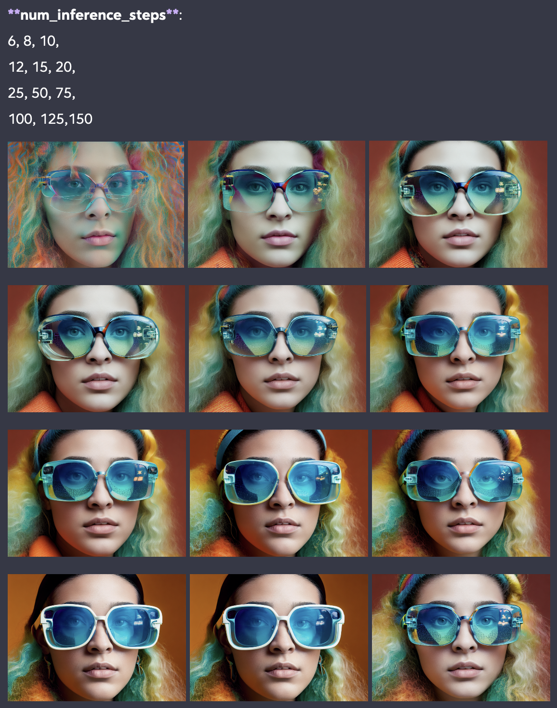
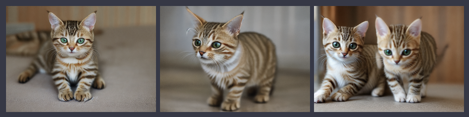
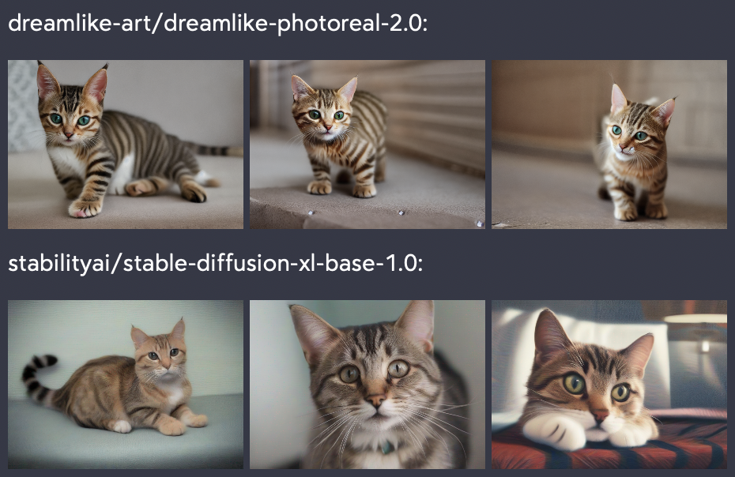
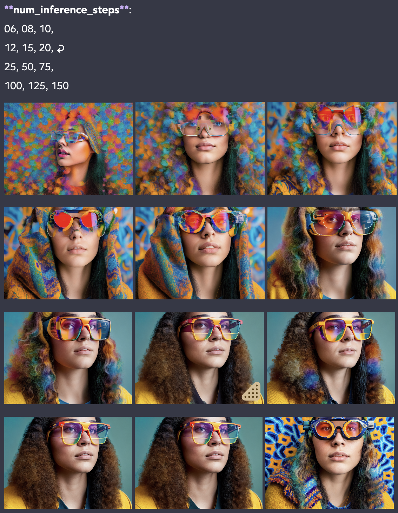
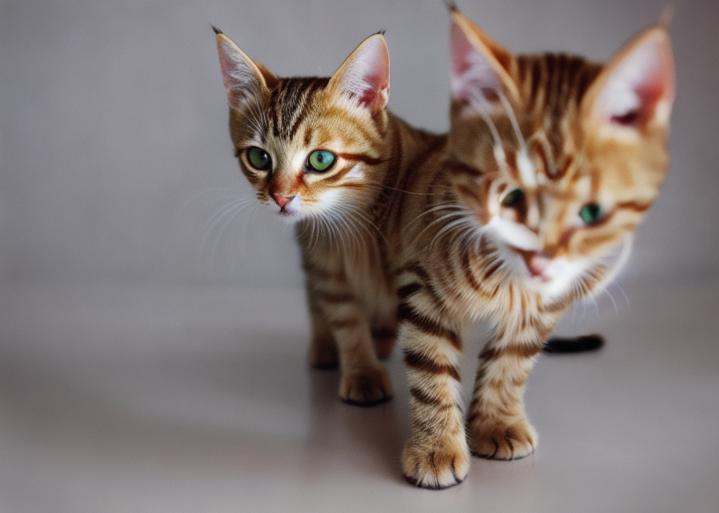
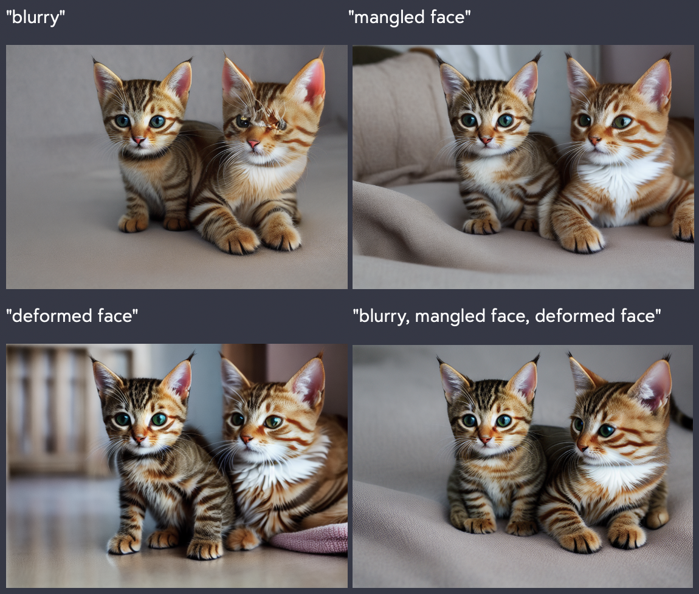
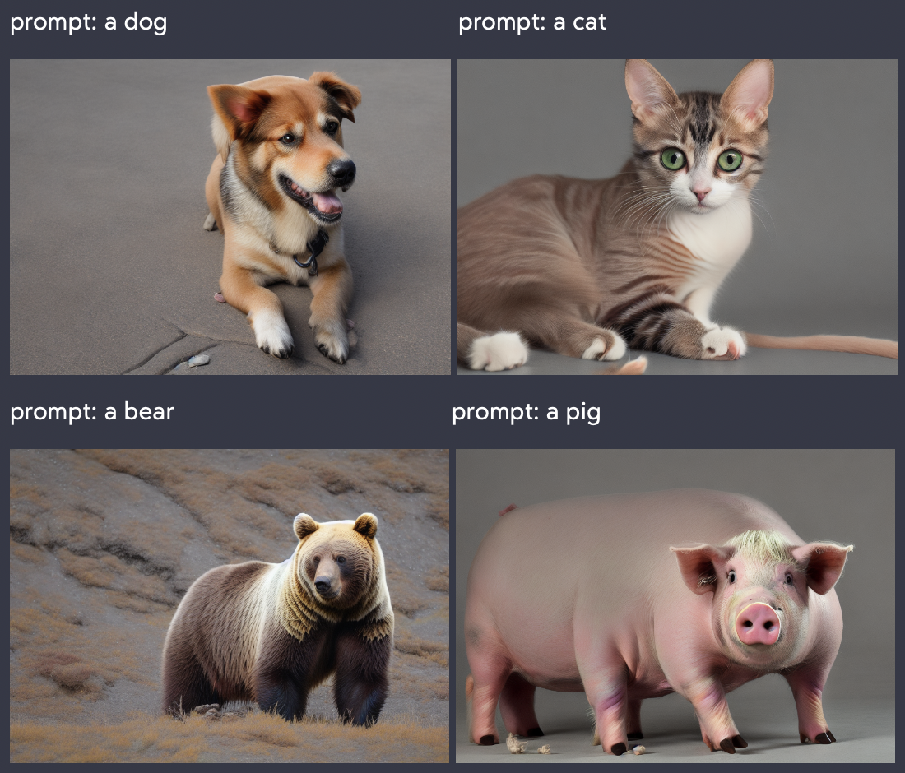
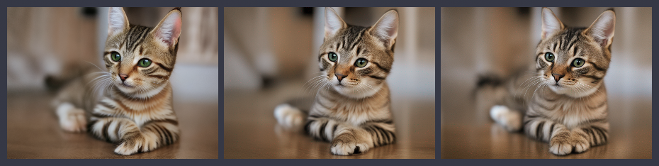
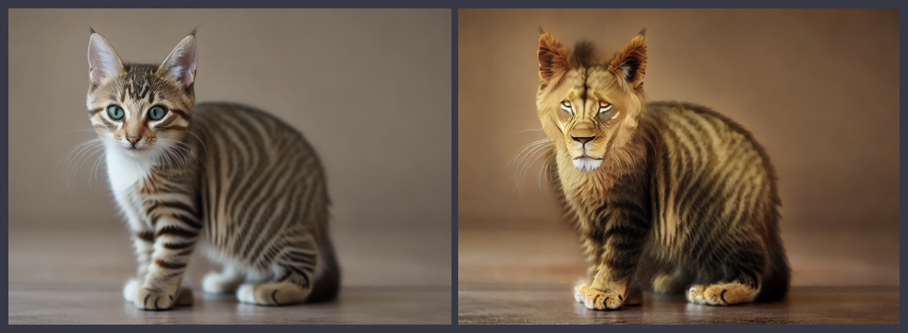

# Diffusion Bench

This is a bench for learning about prompt engineering when using text-to-image and image-to-image diffusion models. It is currently in DRAFT form... I'm not tracking breaking changes.



## Installation

This project uses [uv](https://github.com/astral-sh/uv) to manage the Python
version, the virtual environment, and dependencies. If you don't have [uv](https://github.com/astral-sh/uv?tab=readme-ov-file#installation)
and [direnv](https://direnv.net/) installed, start with that:

```shell
# install uv (see the uv docs for other install methods)
brew install uv direnv

# uv reads the pinned interpreter from .tool-versions (3.12.9)
# and will install it for you on the first sync
uv python install 3.12.9
```

Then you can create the virtual environment and install packages with direnv:

```shell
# configure your ENVVARS
# (open the .envrc.local file and make necessary changes)
cp .envrc.local-example .envrc.local

# create the venv (.venv), run `uv sync`, and enable ENVVARS
direnv allow .
# If you don't want to use direnv, read the .envrc file and
# run those commands (mainly `uv sync`) using your preferred method
```

#### Installation Notes

Dependencies are declared in `pyproject.toml` and locked in `uv.lock`. To add a
dependency, use `uv add`, which updates both files:

```shell
uv add scipy
```

`uv sync` (run automatically by `.envrc`) installs everything from the lockfile.
To upgrade locked versions, use `uv lock --upgrade` followed by `uv sync`.

This project pins `diffusers` to the HuggingFace `main` branch (via
`[tool.uv.sources]` in `pyproject.toml`) so the latest conditioning models and
detectors — including TencentARC/t2i-adapter-lineart-sdxl-1.0 — are available.

## Usage

```shell
python3 -m src [-h] [--prompt PROMPT] [--negative_prompt NEGATIVE_PROMPT]
               [--width WIDTH] [--height HEIGHT] [--count COUNT]
               [--seeds SEEDS] [--models MODELS]
               [--custom_latents CUSTOM_LATENTS] [--steps STEPS]
               [--output_path OUTPUT_PATH]
               [--output_path_template OUTPUT_PATH_TEMPLATE]
               [--input_paths INPUT_PATHS] [--device_type DEVICE_TYPE]
               [--refinement_mode REFINEMENT_MODE] [--copyright COPYRIGHT]

options:
  -h, --help            show this help message and exit
  --prompt PROMPT, -p PROMPT
                        A pipe-delimited list of descriptions of what you would
                        like to render
  --negative_prompt NEGATIVE_PROMPT, -n NEGATIVE_PROMPT
                        A pipe-delimited list of descriptions of what you would NOT like to render (default=None)
  --width WIDTH, -x WIDTH
                        The width of the output image (default=896)
  --height HEIGHT, -y HEIGHT
                        The height of the output image (default=640)
  --count COUNT, -c COUNT
                        The number of images to produce with each given model
                        (default=1)
  --seeds SEEDS, -s SEEDS
                        A comma-separated list of PRNGs to use when generating an
                        image to produce more predictable results and explore an
                        idea
  --models MODELS, -m MODELS
                        A comma-separated list of HuggingFace Models to to use. By
                        default, dreamlike-art/dreamlike-photoreal-2.0 is used to
                        generate an image followed by 3, sequential steps of
                        refinement using stabilityai/stable-diffusion-xl-
                        refiner-1.0
  --custom_latents CUSTOM_LATENTS, -l CUSTOM_LATENTS
                        A comma-separated list of booleans: whether or not to use
                        custom latents (seeds) for each model
  --steps STEPS, -r STEPS
                        A comma-separated list of the number inference steps to use
                        with each model (length must match the length of -m)
  --output_path OUTPUT_PATH, -o OUTPUT_PATH
                        A path to a folder where images will be saved (can be
                        relative)
  --output_path_template OUTPUT_PATH_TEMPLATE, -t OUTPUT_PATH_TEMPLATE
                        A template for naming the files
                        (default=":path/:count_idx-:type-:model_idx.png")
  --input_paths INPUT_PATHS, -i INPUT_PATHS
                        A comma-separated list of paths to images that will be
                        refined or upscaled by the given models
  --device_type DEVICE_TYPE, -d DEVICE_TYPE
                        The type of device the pipes will be fed to for processing
                        (default="cuda" if cuda is supported, else "mps" if apple
                        M1/M2, else "cpu")
  --refinement_mode REFINEMENT_MODE
                        one of: "sequence" (each pass is fed into the next pass),
                        "first_to_many" (each pass is fed the first item
                        generated), or "in_to_many" (each pass is fed the value of
                        -i/--input_paths)
  --copyright COPYRIGHT
                        Set who should be listed as the copyright owner of the
                        images that are created
```

### Running in the background (limiting CPU usage)

Generation is resource-hungry and can make the machine hard to use for anything
else. `run.sh` wraps `python3 -m src` to run it as a lower-priority job: it still
gets most of the CPU when the machine is idle, but yields to interactive work,
and it leaves a couple of cores free for the system. All arguments are passed
straight through:

```shell
./run.sh --prompt "a cute, tabby cat" \
  --models "dreamlike-art/dreamlike-photoreal-2.0" \
  --steps "10"

# run it detached and log output:
./run.sh --prompt "a cute, tabby cat" --models "..." --steps "10" > run.log 2>&1 &
```

Tunables (override via environment):

- `DIFFUSION_BENCH_LEAVE_FREE` — cores to leave free for the system (default: `2`)
- `DIFFUSION_BENCH_NICE` — scheduling priority; higher yields more (default: `15`)
- `PYTORCH_MPS_HIGH_WATERMARK_RATIO` — Apple Silicon only. Caps how much unified
  memory MPS may use so the GPU/UI stays responsive and the machine doesn't swap.
  Unset by default because too low will OOM large models (e.g. HiDream); try `0.7`
  for the smaller SD / dreamlike models.

### Video-to-video (experimental)

Transform an `.mp4` with a prompt. Pass a video to `-i/--input_paths`.

**Coherent (recommended) — AnimateDiff.** Use `-m guoyww/animatediff-v1-5-2`.
A MotionAdapter keeps the output consistent frame-to-frame. It's SD1.5-based, so
downscale to ~512px with `-x/-y`, and bound the clip with `--max_frames` (the
whole window is processed in one pass; arbitrary-length windowing is Phase 3 —
see `docs/plans/video-vid2vid.md`). First run downloads ~2.5GB of weights.

```shell
./run.sh --prompt "analog style, a tabby cat" \
  --models "guoyww/animatediff-v1-5-2" \
  --input_paths "clip.mp4" \
  -x 512 -y 512 --strength 0.6 --guidance_scale 8.5 \
  --fps 12 --max_frames 32
```

**Naive fallback.** `--naive` refines each frame independently with any
img2img-capable model — cheap, but flickers (no temporal coherence).

```shell
./run.sh --prompt "analog style, a tabby cat" \
  --models "timbrooks/instruct-pix2pix" \
  --input_paths "clip.mp4" \
  --naive --strength 0.6 --guidance_scale 8.5 \
  --fps 12 --max_frames 48
```

Video options:

- `--naive` — route video through the per-frame path (needs an img2img model)
- `--strength` — change amount, `0.0`–`1.0` (higher = further from the source)
- `--guidance_scale` / `-g` — prompt adherence
- `--fps` — output frame rate (subsamples when lower than the source)
- `--max_frames` — cap frames processed
- `--window_size` / `--overlap` — window/blend size for the coherent path (unused by `--naive`)
- `--controlnet` — `off` \| `lineart` \| `depth` structure conditioning (coherent path)

Output is written as `.mp4` with a `<name>.mp4.json` sidecar recording the
prompt, model, and parameters (mp4 has no EXIF equivalent).

models:

- [wavymulder/Analog-Diffusion](https://huggingface.co/wavymulder/Analog-Diffusion)
    - NOTE: you have to use "analog style" in the prompt for this to take effect
    - To use a EulerAncestralDiscreteScheduler append "/EulerA" to the model name: "wavymulder/Analog-Diffusion/EulerA"
- [Deci/DeciDiffusion-v1-0](https://huggingface.co/Deci/DeciDiffusion-v1-0)
- [dreamlike-art/dreamlike-photoreal-2.0](https://huggingface.co/dreamlike-art/dreamlike-photoreal-2.0)
- [prompthero/openjourney](https://huggingface.co/prompthero/openjourney)
- [stabilityai/stable-diffusion-2-1](https://huggingface.co/stabilityai/stable-diffusion-2-1)
- [stabilityai/stable-diffusion-2-depth](https://huggingface.co/stabilityai/stable-diffusion-2-depth)
- [stabilityai/stable-diffusion-x4-upscaler](https://huggingface.co/stabilityai/stable-diffusion-x4-upscaler)
- [stabilityai/stable-diffusion-xl-base-1.0](https://huggingface.co/stabilityai/stable-diffusion-xl-base-1.0)
- [stabilityai/stable-diffusion-xl-refiner-1.0](https://huggingface.co/stabilityai/stable-diffusion-xl-refiner-1.0)
- [TencentARC/t2i-adapter-lineart-sdxl-1.0](https://huggingface.co/TencentARC/t2i-adapter-lineart-sdxl-1.0)
- [timbrooks/instruct-pix2pix](https://huggingface.co/timbrooks/instruct-pix2pix)
- [minimaxir/sdxl-wrong-lora](https://huggingface.co/minimaxir/sdxl-wrong-lora)
    - NOTE: you have to use "wrong" as a negative prompt for this to take effect

## Examples

### Generate images (text-to-image)

Given the same prompt, model, and number of inference steps, generate 3 images:

```shell
python3 -m src --prompt "a cute, tabby cat" \
  --models "dreamlike-art/dreamlike-photoreal-2.0" \
  --steps "10" \
  --count 3

# =>
# loading pipeline: dreamlike-art/dreamlike-photoreal-2.0
# Loading pipeline components...: 100%|███████| 5/5
# [00:01<00:00,  4.06it/s]
# prompt:          ['a cute, tabby cat']
# negative_prompt: []
# width:           896
# height:          640
# count:           3
# seeds:           []
# model_ids:       ['dreamlike-art/dreamlike-photoreal-2.0']
# steps:           [10]
# input_paths:     []
# paths:           [['images/out-01-GENERATOR-01.png',
#                    'images/out-02-GENERATOR-01.png',
#                    'images/out-03-GENERATOR-01.png']]
# device:          mps
#
# model_id: dreamlike-art/dreamlike-photoreal-2.0
# prompt: a cute, tabby cat
# kwargs: {'negative_prompt': None, 'num_inference_steps': 10,
#          'width': 896, 'height': 640}
# seed:   4042405154439330027
#
# 100%|████████████████████████████████████| 10/10
# [00:35<00:00,  3.52s/it]
# ...
```



### Generating images using different models (text-to-image)

Given the same prompt, model, and number of inference steps, generate 3 images each, for 2 different models: "dreamlike-art/dreamlike-photoreal-2.0" and "stabilityai/stable-diffusion-xl-base-1.0":

```shell
python3 -m src --prompt "a cute, tabby cat" \
  --models "dreamlike-art/dreamlike-photoreal-2.0, stabilityai/stable-diffusion-xl-base-1.0" \
  --steps "10, 10" \
  --count 3
```



### Evaluate the effects of changing steps (text-to-image)

Given the same prompt, model and seed, generate images using a different number of inference steps for each image:

```shell
python3 -m src --prompt "a cute, tabby cat" \
  --models "dreamlike-art/dreamlike-photoreal-2.0, dreamlike-art/dreamlike-photoreal-2.0, dreamlike-art/dreamlike-photoreal-2.0, dreamlike-art/dreamlike-photoreal-2.0" \
  --steps "10, 15, 20, 25" \
  --seed "1175243130925179488, 1175243130925179488, 1175243130925179488, 1175243130925179488" \
  --count 1
```



### Evaluate negative prompts (text-to-image)

Given a base image with a blurry, mangled face:

```shell
python3 -m src --prompt "a cute, tabby cat" \
  --models "dreamlike-art/dreamlike-photoreal-2.0" \
  --seeds "12621049111909025765" \
  --steps "10"
```



Generate 4 images using a different negative prompt for each image ("blurry", "mangled face", "deformed face", "blurry, mangled face, deformed face"):

```shell
python3 -m src --prompt "a cute, tabby cat" \
  --negative_prompt "blurry | mangled face | deformed face | blurry, mangled face, deformed face" \
  --models "dreamlike-art/dreamlike-photoreal-2.0, dreamlike-art/dreamlike-photoreal-2.0, dreamlike-art/dreamlike-photoreal-2.0, dreamlike-art/dreamlike-photoreal-2.0" \
  --seeds "12621049111909025765, 12621049111909025765, 12621049111909025765, 12621049111909025765" \
  --steps "10, 10, 10, 10"
```



### Evaluate prompts, given the same negative prompt (text-to-image)

Given the same negative prompt, model, seed, and number of inference steps, generate 4 images with different prompts for each image (a dog, a cat, a bear, a pig):

```shell
python3 -m src --prompt "a dog | a cat | a bear | a pig" \
  --negative_prompt "outside" \
  --models "dreamlike-art/dreamlike-photoreal-2.0, dreamlike-art/dreamlike-photoreal-2.0, dreamlike-art/dreamlike-photoreal-2.0, dreamlike-art/dreamlike-photoreal-2.0" \
  --steps "10, 10, 10, 10" \
  --seed "1175243130925179488, 1175243130925179488, 1175243130925179488, 1175243130925179488" \
  --count 1
```



_NOTE the bear has the most outside context. Is this because the model is trained with pictures of domesticated animals both inside and outside, and with wild animals that are primarily outside?_

### Refine images with ensembles (text-to-image + image-to-image)

Given a prompt:

1. generate an image
2. refine the image generated in step 1
3. refine the image refined in step 2

```shell
python3 -m src --prompt "a cute, tabby cat" \
  --models "dreamlike-art/dreamlike-photoreal-2.0, stabilityai/stable-diffusion-xl-refiner-1.0, stabilityai/stable-diffusion-xl-refiner-1.0" \
  --steps "10, 50, 50" \
  --refinement_mode "sequence"
```



### Refine images with ensembles (image-to-image)

Given an input image:

1. load the image from disk
2. refine the image loaded in step 1
3. refine the image refined in step 2

```shell
python3 -m src --prompt "a cute, tabby cat" \
  --input_paths "images/01-generator-01.png" \
  --models "stabilityai/stable-diffusion-xl-refiner-1.0, stabilityai/stable-diffusion-xl-refiner-1.0" \
  --steps "50, 50" \
  --refinement_mode "sequence"
```


### Yes, and... with ensembles (text-to-image + image-to-image)

Given a prompt:

1. generate an image
2. refine the image generated in step 1
3. refine the image refined in step 2

```shell
python3 -m src --prompt "a cute, tabby cat | replace the cat with a lion" \
  --models "dreamlike-art/dreamlike-photoreal-2.0, timbrooks/instruct-pix2pix" \
  --steps "10, 10" \
  --refinement_mode "sequence"
  --seed "16340881476748913736"
```




## Licensing

Make sure to read the licenses for any model you use with this. The licenses vary from model to model. For instance dreamlike-art/dreamlike-photoreal-2.0 uses an adaptation of Creative Commons and limits corporate usage.

This bench should not be used to intentionally create or disseminate images that create hostile or alienating environments for people. This includes generating images that people would foreseeably find disturbing, distressing, or offensive; or content that propagates historical or current stereotypes.
